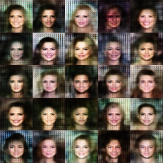

# vaegan-celeba
This is a keras implementation of the paper "Autoencoding beyond pixels using a learned similarity metric" by Larsen, A., et al.

VAEGAN Model

# Dependencies
 - keras
 - tensorflow
 - OpenCV
 - numpy

Training:
 - train-celeba.py was used to train the VAE model.
 - gan-celeba.py was used to train the GAN model.
 - add "-w" to load weights (e.g. python train-celeba.py -w vae-model.h5)
 - models_celebA.py contains models used for this project.
 - celebA_loader.py contains the data loader used to load the CelebA dataset.
 - CelebA dataset was used for training the model

# Results

VAE (Images from noise input):

VAE Autoencoder (output-left; input-right):

GAN (Images from noise input):

VAEGAN (Images from noise input):

VAEGAN Autoencoder (output-left; input-right):

# References
 - "Autoencoding beyond pixels using a learned similarity metric" by Larsen, A., et al. (https://arxiv.org/abs/1512.09300)
 - CelebA Dataset (http://mmlab.ie.cuhk.edu.hk/projects/CelebA.html)
